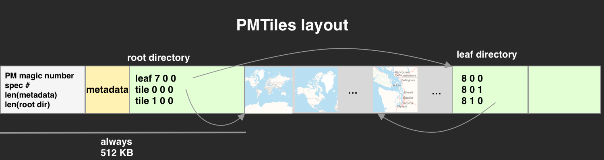

# PMTiles

PMTiles is a single-file archive format for tiled data. A PMTiles archive can be hosted on a commodity storage platform such as S3, and enables low-cost, zero-maintenance map applications that are "serverless" - free of a custom tile backend or third party provider.

[Protomaps Blog: Dynamic Maps, Static Storage](http://protomaps.com/blog/dynamic-maps-static-storage)

[Demo](https://protomaps.github.io/PMTiles/examples/leaflet.html) - watch your network request log

See also:
* [Cloud Optimized GeoTIFFs](https://www.cogeo.org)

## How To Use

### Go

See https://github.com/protomaps/go-pmtiles

### Python

    pip install pmtiles
    pmtiles-convert TILES.mbtiles TILES.pmtiles
    pmtiles-convert TILES.pmtiles DIRECTORY
    pmtiles-show TILES.pmtiles // see info about a PMTiles directory
    pmtiles-serve TILES.pmtiles // start an HTTP server that decodes PMTiles into traditional Z/X/Y paths

See https://github.com/protomaps/PMTiles/tree/master/python/bin for library usage

### JavaScript

    

Example of a raster PMTiles archive decoded and displayed in Leaflet:

    const p = new pmtiles.PMTiles('osm_carto.pmtiles',{allow_200:true})
    p.leafletLayer({attribution:'© <a href="https://openstreetmap.org">OpenStreetMap</a> contributors'}).addTo(map)
    
## Specification

PMTiles is a binary serialization format designed for two main access patterns: over the network, via HTTP 1.1 Byte Serving (`Range:` requests), or via memory-mapped files on disk. **All integer values are little-endian.**

A PMTiles archive is composed of:
* a fixed-size 512,000 byte header section
* Followed by any number of tiles in arbitrary format
* Optionally followed by any number of *leaf directories*

### Header
* The header begins with a 2-byte magic number, "PM"
* Followed by 2 bytes, the PMTiles specification version (currently 1)
* Followed by 4 bytes, the length of metadata (M bytes)
* Followed by 2 bytes, the number of entries in the *root directory* (N entries)
* Followed by M bytes of metadata, by convention a JSON object
* Followed by N * 17 bytes, the root directory.

### Directory structure
A directory is a contiguous sequence of 17 byte entries. A directory can have at most 21,845 entries. 

An entry consists of:
* 1 byte: the zoom level (Z) of the entry, with the top bit set to 1 instead of 0 to indicate the offset/length points to a leaf directory and not a tile.
* 3 bytes: the X (column) of the entry.
* 3 bytes: the Y (row) of the entry.
* 6 bytes: the offset of where the tile begins in the archive.
* 4 bytes: the length of the tile, in bytes.

### Notes
* A full directory of 21,845 entries holds exactly a complete pyramid with 8 levels, or 1+4+16+64+256+1024+4096+16384.
* A PMTiles archive with less than 21,845 tiles should have a root directory and no leaf directories.
* Multiple tile entries can point to the same offset; this is useful for de-duplicating certain tiles, such as an empty "ocean" tile.
* Analogously, multiple leaf directory entries can point to the same offset; this can avoid inefficiently-packed small leaf directories.

### Implementation suggestions
* PMTiles is designed to make implementing a writer simple. Reserve 512KB, then write all tiles, recording their entry information; then write all leaf directories; finally, rewind to 0 and write the header.
* The order of tile data in the archive is unspecified; an optimized implementation should arrange tiles on a 2D space-filling curve.
* PMTiles readers should cache directory entries by byte offset, not by Z/X/Y. This means that deduplicated leaf directories result in cache hits.

## License

The reference implementations of PMTiles are published under the BSD 3-Clause License. The PMTiles specification itself is public domain, or under a CC0 license where applicable.
